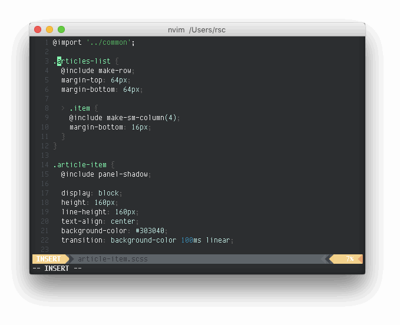

# vim-xtract

> Extract the selection into a new file

vim-xtract helps you split up large files into smaller files. Great for refactoring.



## Installation

Add `rstacruz/vim-xtract` using your favorite Vim plugin manager. For [vim-plug](https://github.com/junegunn/vim-plug), that's:

```vim
Plug 'rstacruz/vim-xtract'
```

## Usage

Select a few lines. You can use a visual selection (<kbd>V</kbd>) or using text objects (<kbd>v</kbd><kbd>ap</kbd><kbd>ap</kbd>...). Then press:

```
:Xtract newfilename⏎
```

This extracts from the current file into a new file `newfilename.js` in the same directory, keeping the extension of the current file.

## Copying headers

You can copy the files headers and leave an import statement behind (eg, `import X from './X'`).

```
:'<,'>Xtract FILENAME N
```

- `'<,'>` — the range of the body
- `FILENAME` — the new file (no extension)
- `N` — number of lines in the header (optional)

#### Example

Let's say you have a file like this `index.js` below. We want to extract the header (first 3 lines) and a function body (last 3 lines) into a new file, `MyComponent.js`.

```
[index.js]
 1   // @flow
 2   import React from 'react'
 3
 4   export function App () {
 5     return <MyComponent />
 6   }
 7
 8   export function MyComponent () {
 9     return <div></div>
10   }
```

Select the body first (lines `8` to `10`) using <kbd>V</kbd>, then type:

```
:Xtract MyComponent 3⏎
```

This copies lines 1-3 into a new buffer (the header) and 8-10 right after it (the block). The resulting files will look like these:

```diff
 [index.js]
  // @flow
  import React from 'react'
+ import MyComponent from './MyComponent'

  export function App () {
    return <MyComponent />
  }
-
- export function MyComponent () {
-   return <div></div>
- }
```

```diff
 [MyComponent.js]
+ // @flow
+ import React from 'react'
+
+ export function MyComponent () {
+   return <div></div>
+ }
```

## Updating placeholders

Edit `g:xtract_placeholders` to update the string it leaves behind:

```js
let g:xtract_placeholders = {
\ "javascript": "import %s from './%s'",
\ "jsx": "import %s from './%s'",
\ "scss": "@import './%s';",
\ "sass": "@import './%s'",
\ }
```

## Thanks

**vim-xtract** © 2016-2017, Rico Sta. Cruz. Released under the [MIT] License.<br>
Authored and maintained by Rico Sta. Cruz with help from contributors ([list][contributors]).

> [ricostacruz.com](http://ricostacruz.com) &nbsp;&middot;&nbsp;
> GitHub [@rstacruz](https://github.com/rstacruz) &nbsp;&middot;&nbsp;
> Twitter [@rstacruz](https://twitter.com/rstacruz)

[](https://github.com/rstacruz) &nbsp;
[](https://twitter.com/rstacruz)

[MIT]: http://mit-license.org/
[contributors]: http://github.com/rstacruz/vim-xtract/contributors
